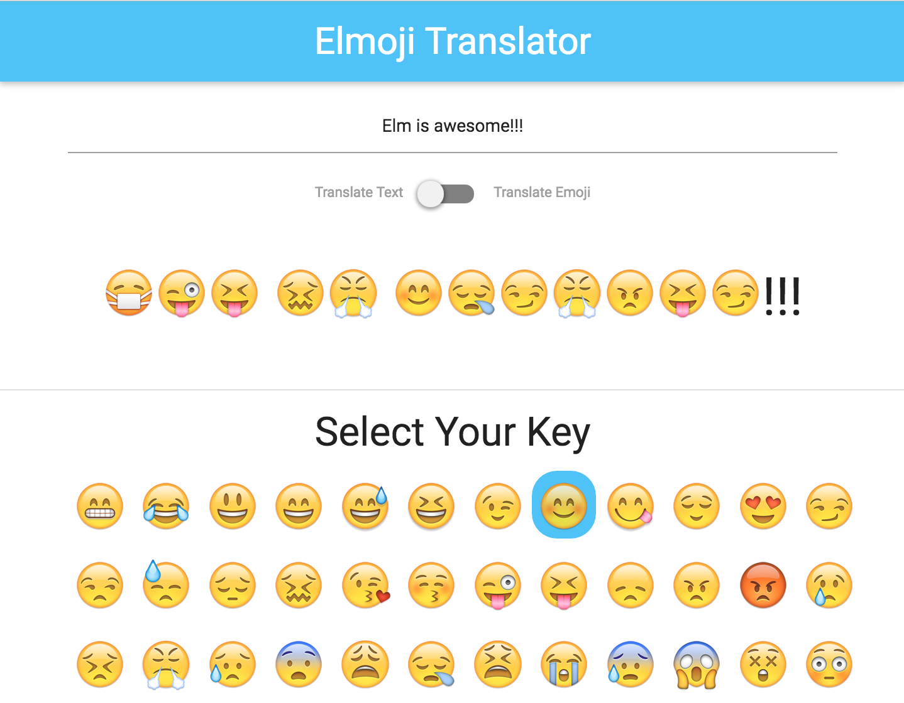
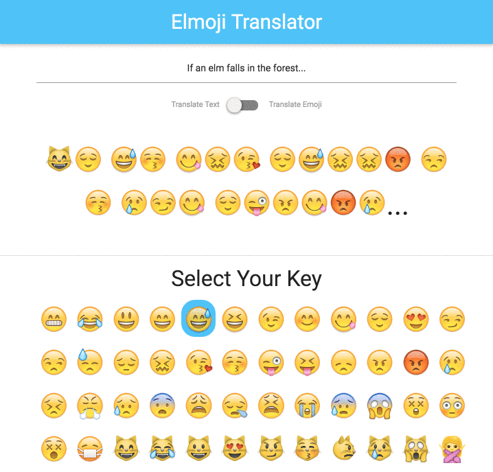

# Choose Your Own Emoji

For this lesson, we'll allow our users to choose which emoji to use when encoding their messages. That way, they can send secret messages to each other that can only be decoded if they have the right key! It will eventually look like this:



There's a lot to do! Let's do this!

Note: Your code should currently [look like this](https://github.com/elmbridge/elmoji-translator/tree/release-3-part-2). You can either carry your code over from the last lesson, or download and recompile [the code from GitHub.](https://github.com/elmbridge/elmoji-translator/releases/tag/release-3-part-2)


## Goals

  - Use transformation functions to render dynamic HTML.
  - Use complex `Html` functions to render conditional classes.
  - Model a domain using tagged values.
  - Implement a full feature from start to finish.

## Steps

### Adding New UI Elements

As we did with our last lesson, let's start first by updating `View.elm` with our new UI elements. The eventual markup should look like this:

```html
<!-- code for text input and lever -->
<div class="divider"></div>
<section class="container">
  <h4 class="center">Select Your Key</h4>
  <div class="row">
    <div class="col s2 m1 emoji-size">
      <div class="key-selector">😁</div>
    </div>
    <div class="col s2 m1 emoji-size">
      <div class="key-selector">😅</div>
    </div>
    <!-- ... -->
  </div>
</section>
```

Take a crack at converting this to Elm. Some of this is straightforward — we already know how to render static elements with attributes and children using the `Html` module. We also already have a list of all supported emojis in `EmojiConverter.supportedEmojis`. But how will we render all those emojis without a lot of copying and pasting?

Elm shines in situations like this. Since `View.view` is simply Elm code, and `Html.Html` is just another type in Elm, we can use normal transformations to produce HTML. We can use `EmojiConverter.supportedEmojis` in combination with the `List` module to convert that list of emojis into a list of HTML elements!

The code in `View.view` can use a helper function to render all emoji keys, like this:

```elm
  -- ...
  [ Html.h4
    [ Html.Attributes.class "center" ]
    [ Html.text "Select Your Key" ]
  , renderKeys
  ]
```

And we can write `renderKeys` to iterate over the list of supported emojis and call another helper function, `renderKey`.

```elm
renderKeys =
    Html.div
        [ Html.Attributes.class "row" ]
        (List.map (\emoji -> renderKey emoji) EmojiConverter.supportedEmojis)
```

It's worth taking a moment to explain what `List.map` is doing. Much like `Array.prototype.map` in JavaScript, `List.map` takes a function and a list, calling the function on each element on the list and returning a list of the produced values. The `(\... -> ...)` syntax is how you define an **anonymous function** in Elm.

If you want to learn more, the `List` module is thoroughly documented on [package.elm-lang.org](http://package.elm-lang.org/packages/elm-lang/core/latest/List). The site is a great resource if you want to learn more about the public API for available Elm packages and core modules.

Now, it's your turn! Add the new markup to `View.view`, with the `renderKeys` and `renderKey` helper functions. If you get stuck, you can see [a completed version of this step here](https://github.com/elmbridge/elmoji-translator/releases/tag/release-4-part-1).

### Displaying the Currenlty Selected Key

There's one more part of the UI that we have to render — we have to display the currently selected key as selected. If we give the specified emoji `.key-selector` a class of `.is-selected`, it will display with a blue background. For now, we'll
hard code the selected key to `Model.defaultKey`.

When you have to conditionally attach classes to an HTML element in Elm, the `Html.Attributes.classList` function is helpful in simplifying the code. The function consumes a list of tuples, with each tuple containing a string (representing a class) and a boolean (describing whether the class should be attached to the element). The code for rendering the `.key-selector` element might look something like this:

```elm
Html.div
    [ Html.Attributes.classList
        [ ( "key-selector", True )
        , ( "is-selected", emoji == Model.defaultKey )
        ]
    ]
    [ Html.text emoji ]
```

Once you've added that code to your `renderKey` function, you should have a working, if static, UI!

### Adding User Actions

Now that we've updated the UI, we have to map our new user action to a message for our application to consume. Add the following line of code to your `renderKey` function, as an attribute to the element with a class of `.key-selector`:

```elm
Html.Events.onClick (Update.SetSelectedKey emoji)
```

When this element is clicked, a `Msg` of `Update.SetSelectedKey String` will be triggered, which will eventually be consumed by our application.

Like `SetCurrentText String`, `SetSelectedKey String` is a **tagged value**. In effect, we are saying that `SetCurrentText` and `SetSelectedKey` are only valid values of the `Msg` union type if they are accompanied by a string.

Tagged values are helpful for modeling systems with uneven information requirements. For instance, if we were modeling a coffee shop, we might structure our data like this:


```elm
type BrewingStrategy = PourOver | FrenchPress

type Milk = Cow | Soy | Almond

type alias NumberOfEspressoShots = Integer

type DrinkOrder
  = BlackCoffee BrewingStrategy
  | Latte NumberOfEspressoShots Milk
  | HotChocolate Milk
  | ColdBrew
```

Apparently, there's a lot of complexity bundled up in our drink orders! In some cases, we need to know what kind of milk the customer wants. In other cases, we need to know information specific to only one kind of drink. The above data model accounts for that complexity by using tagged values — a `HotChocolate` is only a valid `DrinkOrder` if it is accompanied by a `Milk` selection, and a `BlackCoffee` relies on another union type to determine the customer's preferred brewing strategy.

We could have also modeled this problem with a record, but the data would have likely been harder to follow. What would the `.milk` field on that record mean, if the customer wanted black coffee? Why would we need a `.numberOfEspressoShots` in order to make a hot chocolate?

Tagged values are also helpful in preventing bad data from propagating through our system. For instance, a drink order of "single shot latte" isn't enough in the real world — if we tried to make it, we wouldn't know what kind of milk our customer wanted. Tagged values protect us here — if we tried to use `Latte 1` in a function that was expecting something of the type `DrinkOrder`, our code would fail to compile.

So let's wire up our new tagged value to `Update.update`! In order:

- Add the aforementioned `onClick` attribute to the `.key-selector` element.
- Add the new `SetSelectedKey String` value to `Update.Msg`, and ensure that `Update.update` handles the new case.
- Find a way to store the key information on the model, perhaps in a new field called `selectedKey`.
- Ensure that you the model initialization logic still works. We should start off the application with a `model.selectedKey` value of `Model.defaultKey`.
- Implement the `SetSelectedKey String` case of `Update.update`, so that it updates the model with the correct `selectedKey`.

That's a lot! Work slowly, and lean on your compiler for help. If you get stuck, you can see [a completed version of this step here](https://github.com/elmbridge/elmoji-translator/tree/release-4-part-2).

### Displaying Model Values

Now that `Update.update` consumes our new message, we need to reflect changes to the model onto the UI. First off, we need to use our new `model.selectedKey` field to display to the user which key is currently selected. As of now, our `renderKeys` function does not consume `model`, so it has no idea about the current state of the application. Let's change that! `renderKeys` should look like this:


```elm
renderKeys model =
    Html.div
        [ Html.Attributes.class "row" ]
        (List.map (\emoji -> renderKey model emoji) EmojiConverter.supportedEmojis)
```

You will have to change the call site of `renderKeys` in `View.view` to match the new signature of the function, and you will have to change `renderKey` to consume a model. Once that's done, you can use `model.selectedKey` in place of `Model.defaultKey` when checking whether a key is selected. The UI should now show you which key is selected, as you click on them!

### Changing our Cipher

And now, for the final step — we need to change our translation key based on the value of `model.selectedKey`! When you're done, your application should work like this:



You definitely know enough Elm to figure this out for yourself. However, if you get stuck, check out [a working solution here](https://github.com/elmbridge/elmoji-translator/tree/release-4-part-3).

And with that, you've completed your first Elm application!
