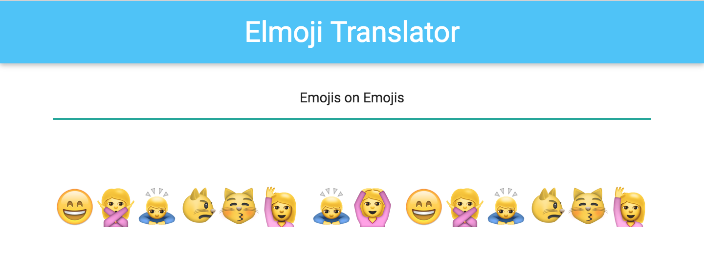

# Emojification

Up until now, this project has had a severe lack of emojis. In this lesson, we'll learn how to use an external module to translate text into emojis. Once we're done, it should look something like this:




Your code should currently look like the code in `Part2.elm`. You can either carry your code over from the last lesson, or start with the `Part2.elm` code.


## Goals

  - Access and utilize code in other modules
  - Be able to write helper functions
  - Understand where to place domain-specific code

## Steps

### Emoji Converter

Spoiler alert: Emojis are complicated! And creating a [decoder-ring-style][secret decoder rings] translator between plain text and emojis is no small feat. Thankfully, one of your teammates has already written an emoji converter library for you to use, so you don't have to deal with that complexity! The code is already in your skeleton, in `EmojiConverter.elm`.

  [secret decoder rings]: https://en.wikipedia.org/wiki/Secret_decoder_ring

(In the style of [secret decoder rings], `EmojiConverter` implements a simple [substitution cipher] that works by replacing all the letters in a message with the corresponding letter in a shifted alphabet.  A shared, secret value (called the "key") determines how much shifting occurs, and the original message can later be recovered if the key is known.)

  [substitution cipher]: https://en.wikipedia.org/wiki/Substitution_cipher

We'll need to use that code to convert the display text from plain text to emojis. But how do we pull that code in to our application code?

That's where the Elm **module** system comes into play. Modules are simply collections of related functions. They are helpful for encapsulating behavior, and for providing clear boundaries between libraries. Let's take a look at the first few lines of `EmojiConverter.elm`:

```elm
module EmojiConverter exposing (textToEmoji, emojiToText, supportedEmojis)
```

Like all Elm files, `EmojiConverter.elm` starts off by telling us what module it defines. In other files, we'll be able to call its functions by using the `EmojiConverter` namespace, in the same way we use the `Html` or `List` namespaces.

This line also tells us the public API for the `EmojiConverter` module — regardless of what else is defined in this file, other files can, at most, access the three functions defined above. Of the three publicly accessible functions, the `textToEmoji` function seems like exactly what we are looking for.

Let's import the module into our file, by adding this to the list of imports:

```elm
import EmojiConverter
```

Now let's try using the `textToEmoji` function in our output text section.


```elm
Html.p
    [ Html.Attributes.class "center output-text emoji-size" ]
    [ Html.text (EmojiConverter.textToEmoji model.currentText) ]
```

Let's try to compile this, and...uh oh! You should be getting the following error:

```
-- TYPE MISMATCH -------------------------------------------------- ././Part2.elm

The argument to function `text` is causing a mismatch.

42|                       Html.text (EmojiConverter.textToEmoji model.currentText)
                                     ^^^^^^^^^^^^^^^^^^^^^^^^^^^^^^^^^^^^^^^^^^^^
Function `text` is expecting the argument to be:

    String

But it is:

    String -> String
```

This error might seem like gibberish at first, but stay strong — Elm error messages are very good at telling you exactly what you need to know. In this case, it seems that, instead of passing `Html.text` a string to render, we are passing it a function that takes a string and returns a string. In Elm-land, that often means that you passed too few arguments into a function — if a function takes two arguments, and you only provided it one, it will return a **partially-applied function** that still needs one more argument!

As you may have guessed, it seems like we're using `EmojiConverter.textToEmoji` incorrectly. Let's take a look at its definition in `EmojiConverter.elm` to figure out how to use it:

```elm
type alias Key =
    String


textToEmoji : Key -> String -> String
textToEmoji key text =
  ...
```

Apparently, `textToEmoji` takes two arguments — a `Key` and a `String`, and returns a converted `String`. If we look a few lines above in the file, we see that `Key` is simply an alias for `String`.

Of course! Like any good decoder ring, the `EmojiConverter` library uses a key to determine how to encode and decode messages. In this case, the key can be one of the emojis supported by the library. In order to turn text into emojis, we need to give it a key, as well as the text we hope to translate.

Let's go back to our code, and hard-code an emoji as the translation key.


```elm
Html.p
    [ Html.Attributes.class "center output-text emoji-size" ]
    [ Html.text (EmojiConverter.textToEmoji "😅" model.currentText) ]
```

Recompile the code, refresh your browser, and you should be in business!

### Our First Refactor

While this solution works, I'd argue that the code has become harder to follow. Let's refactor!

First off, let's extract a helper function for translating text. We can add a function that consumes a model and returns emojis:

```elm
translateText model =
    EmojiConverter.textToEmoji "😅" model.currentText
```

Note: Type signatures are always optional in Elm, but they are highly encouraged — type signatures can be a good form of documentation, and they help the compiler make educated guesses about what went wrong when your code fails to recompile. Feel free to add your own to `translateText`!

We can now use this function in our `view` function.

```elm
Html.text (translateText model)
```

Recompile your code and make sure everything still works!

### Emoji Key

Finally, let's pull out the hard-coded emoji key into something more readable. Let's create a `defaultKey` that returns the "😅" emoji. Switch out the reference to the "😅" emoji key with references to the new `defaultKey` function.

Once you think you've got it, recompile to make sure it worked. If you get stuck, check out `Part3.elm` to see how we've implemented it, or flag down a TA or instructor.
