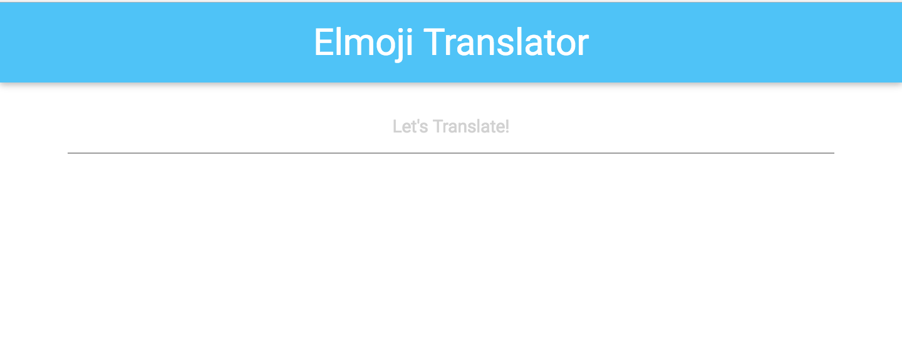

# Making it Dynamic

In this lesson, we'll start making our emoji translator application! Eventually, the user will be able to "encrypt" messages using an emoji key, so that users can pass secret messages to each other. The final product will look something like this:


We need to walk before we run, though! First, we'll make an application that simply consumes text input provided by the user and displays it back to the page.

## Goals

  - Download and run the Skeleton Elmoji app.
  - Understand how to use Elm to make things change on the page.

## Steps

### <input type="checkbox"> Step 1

Download the Skeleton app here: [https://github.com/elmbridge/elmoji-translator/releases/tag/release-0](https://github.com/elmbridge/elmoji-translator/releases/tag/release-0) and navigate to the downloaded folder. Start `elm-reactor`:

```sh
elm-reactor
```

And then go to [http://localhost:8000/Main.elm](http://localhost:8000/Main.elm) in your web browser. You should now have a fully functional Elm application running in your browser! It should look like this:



### <input type="checkbox"> Step 2

As you may have already noticed, however, this Elm application doesn't *do* anything. While you can enter text on the page, the application seems to ignore it.

Our goal is to make the text that the user enters display back to them, like this:


As we learned in [the last lesson](The Elm Architecture.html), every Elm application is built upon the `model`, `view`, and `update` triad. This app is no different – in order to implement this feature, we may need to change all three.

First, let's take a look at the model in `Model.elm`:


```elm
type alias Model =
    { currentText : String }
```

For this application, the model is a record that contains a `currentText` field that must be a string. That's perfect for our feature — as a user inputs text into the application, we'll update the `currentText` field, and reflect its new value to the UI.

Let's verify that user text input is mapped to a `message`. First, let's look in `View.elm`, which is much bigger than it was in the last lesson! Specifically, let's take a look at the code for input field.

```elm
Html.input
  [ Html.Attributes.type' "text"
  , Html.Attributes.class "center"
  , Html.Attributes.placeholder "Let's Translate!"
  , Html.Events.onInput Update.SetCurrentText
  ]
  []
```

It's worth taking a moment to discuss the API for the `Html` module. Almost all functions in this module have the same structure — they consume a list of HTML attributes (like `class`, `id`, `display`, etc.) as well as a list of child elements that are nested inside them.

While the API is somewhat verbose, much of its contents are probably familiar to you. In this case, the code is generating an `input` element with a type of `text` and a class of `center` and some placeholder text. The resulting HTML looks like this:

```HTML
  <input type="text" class="center" placeholder="Let's Translate!">
```

The final attribute comes from the `Html.Events` module, which describes which `Update` message is sent when the element hears an `input` event. In this case, a `message` called `SetCurrentText` is sent, along with the element's current text. (`SetCurrentText String` is actually a tagged value — don't worry, we'll cover that in a future lesson!)

This is great! When this `message` is sent, we can update our model with the new value. To do that, let's check out `Update.elm`:

```elm
update msg model =
    case msg of
        SetCurrentText newText ->
            -- currently, this does nothing!
            model
```

Whenever an update message is sent, the `Update.update` function consumes the sent message, the current model, and returns a new model to render. Currently, the `SetCurrentText` message is handled by this function, but the function simply returns the old model.

Let's change that. Instead, we should have the update function update the model's `currentText` value whenever the message `SetCurrentText` is sent. Let's use record update syntax to do so:

```elm
update msg model =
    case msg of
        SetCurrentText newText ->
          { model | currentText = newText }
```

Once you've made the change, recompile your code by running the following:

```sh
elm-make Main.elm --output dist/main.js
```

The compiler will tell you about any errors you made, or let you know that everything is working!

### <input type="checkbox"> Step 3

Great, so we're now updating the model every time the user inputs text into our application. However, that's only half the battle — we still need to display the application's `currentText` back to the user!

Thankfully, the skeleton already includes some styling for us. All we need to do is add code to our `View.view` function to display a paragraph tag right after our input tag, with the model's `currentText` as its value. The resulting HTML should look like this:


```HTML
  <p class="center output-text emoji-size">It's happening!!!</p>
```

In Elm, the code to generate that HTML would look like this:

```elm
Html.p
    [ Html.Attributes.class "center output-text emoji-size" ]
    [ Html.text "It's happening!" ]
```

Note: `Html.text` is a special kind of `Html` function, that produces a plain-text node. In this case, we've built a paragraph element with a nested child element that is simply plain text.

Insert the above code into the `View.view` function, as a list element after the div with a class of `.input-field`. Once you think you have it, recompile your code to see if it worked.

### <input type="checkbox"> Step 4

We don't want the text to always be `It's happening!`, though. Instead, the text of the paragraph node should reflect the `currentText` of the current model. As the model changes, this paragraph node should change as well.

You'll notice that the `View.view` function consumes a model. This model represents the current state of the application! So if we use record getter syntax, we can pull the `currentText` value out of the model and use it, like this:

```elm
Html.p
    [ Html.Attributes.class "center output-text emoji-size" ]
    [ Html.text model.currentText ]
```

Recompile your code, refresh your browser, and you should have a fully functional, dynamic application!
