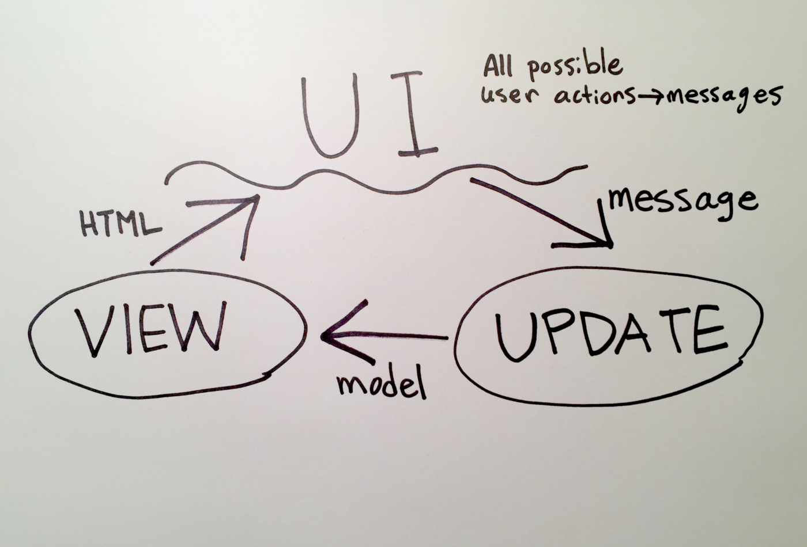
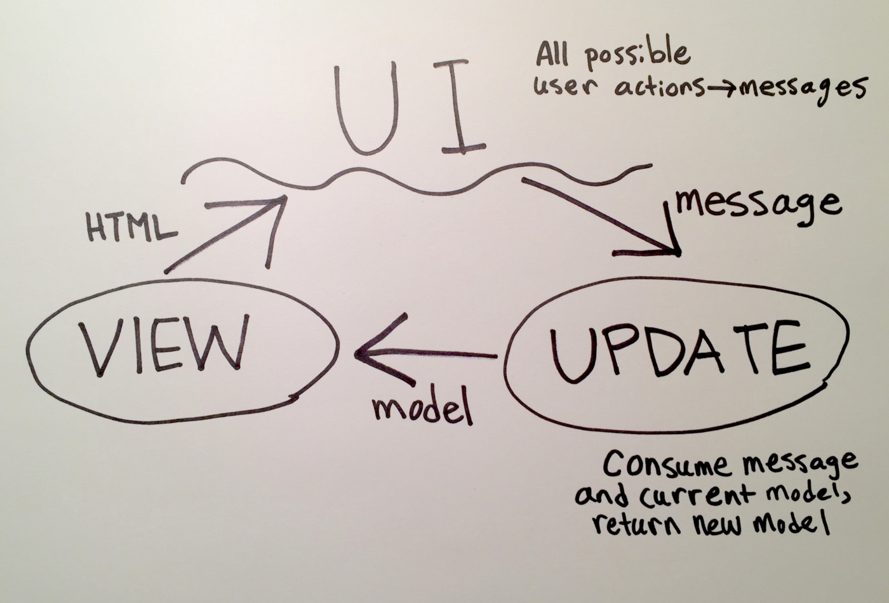
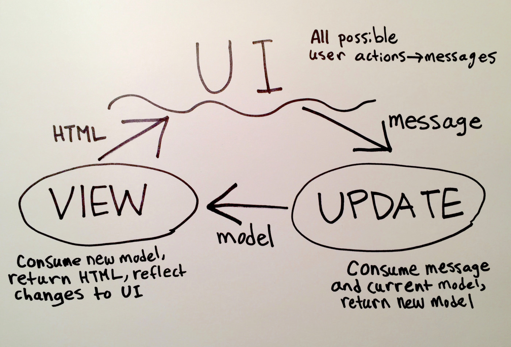

# Our First Full Feature

While emojis are great, a one-way translator from text to emojis is not particularly useful. We need to be able translate in both directions, like this:


This is complex feature — to implement it, we'll have to change every part of our application. Let's get started!

Note: Your code should currently [look like this](https://github.com/elmbridge/elmoji-translator/tree/release-2). You can either carry your code over from the last release, or download and recompile [the code from GitHub.](https://github.com/elmbridge/elmoji-translator/releases/tag/release-2)


## Goals

  - Write Elm view code using HTML as a template.
  - Add a new message for your application to consume.
  - Extend a type alias and fix subsequent compiler errors.
  - Use union types to store information in more literate ways.

## Steps

### <input type="checkbox"> Step 1

 First, let's start in `View.elm`, where we'll map user actions in the UI to messages for our application to consume.



In our case, we want to build a switch that will allow users to toggle between "Translate Text" and "Translate Emoji." We can use the [materialize.css](http://materializecss.com/) lever component to do the job. Between the text input and paragraph tag in our `View.view` function, you should insert the following markup:

```html
<div class="switch center">
  <label>
    Translate Text
    <input type="checkbox"></input>
    <span class="lever"></span>
    Translate Emoji
  </label>
</div>
```

Take a shot at translating the above HTML to Elm! Some tips if you get stuck:
  - Most `Html` functions take two arguments: a list of attributes (produced by the `Html.Attributes` and the `Html.Events` modules) followed by a list of child elements. In this case, our `div` has one child (the `label` element), which itself has four children!
  - To render plain text elements, use `Html.text`. It simply takes a string as its argument.
  - Compile early and often! The Elm compiler will nudge you in the right direction if your syntax is off.

If you get stuck, flag down an instructor to help you through it! Alternatively, you can see [a working solution here](https://github.com/elmbridge/elmoji-translator/tree/release-3-part-1).

### <input type="checkbox"> Step 2

Now that we have a working lever, we need to wire it up to our `Update.update` function! Let's look at our `Update.elm` file, and see what messages our `Update.update` function can currently consume.

```elm
type Msg
    = SetCurrentText String
```

The above code declares a **union type** — it defines a new type that we can use in our program, along with all its possible **values**. In this case, we have a custom type `Msg` that describes the various kinds of messages our application can consume. Currently, there is exactly one possible value: `SetCurrentText String`, which is triggered whenever the user inputs text into the translation box.

But that's not good enough for us! Our `Update.update` function also has to handle the user toggling between translation modes. Let's add another possible value to our union type declaration:

```elm
type Msg
    = SetCurrentText String
    | ToggleDirection
```

We'll make sure our lever triggers the new `ToggleDirection` `Msg` whenever the user clicks it!

If you try to compile now, you'll notice that the compiler realizes something is wrong:

```elm
==== error in Update.elm:13:5: ====
This `case` does not have branches for all possibilities.
You need to account for the following values:
    Update.ToggleDirection
Add a branch to cover this pattern!
```

Helpfully, the Elm compiler enforces **case exhaustiveness** – since our `Update.update` function doesn't handle our new `ToggleDirection` value, the compiler realizes that triggering that `Msg` will break our program. Let's fix it by adding another clause to our case statement, this time matching on the pattern `ToggleDirection`.

```elm
ToggleDirection ->
  -- currently, this does nothing!
  model
```

Finally, let's make our view actually trigger our new `Msg` value. Add the following attribute to the lever's HTML in `View.view`:

```elm
Html.Events.onClick Update.ToggleDirection
```

Compile, and make sure everything works! If you want, you can see [a working solution here](https://github.com/elmbridge/elmoji-translator/tree/release-3-part-1).

### <input type="checkbox"> Step 3

When our `Update.update` function receives a `ToggleDirection` message and the current `model`, it should return a new, changed `model`:



Eventually, our `View.view` function will reflect those changes to the user.

First thing's first — we need to find a way to describe the current direction in our `Model`. Let's take a look at `Model.elm`:

```elm
 type alias Model =
    { currentText : String }
```

Currently, `Model` is a **type alias** for a record with a key `currentText`. A type alias works a lot like a union type declaration — it also produces a new type that we can use in our program. The only difference is that type alias shares its behavior with the type to which it is aliased. They are helpful for making type signatures simple and readable.

In this case, the `Model` type is simply an alias for "a record with a single key called `currentText`." We'll need to extend that alias, by adding another key:

```elm
 type alias Model =
    { currentText : String
    , direction: -- ????
    }
```

But wait, what *is* direction? In other languages, we might describe the current direction as a string, with possible values "emoji-to-text" and "text-to-emoji". We could also model it as a boolean value, perhaps renaming it `translatingTextToEmoji`.

In Elm, we have a more powerful tool at our disposal: union types! We can simply create a union type that enumerates all possible values for a direction, which keeps the code readable and fault tolerant. In `Model.elm`, let's create a custom `Direction` type with two possible values:

```elm
type Direction
    = TextToEmoji
    | EmojiToText
```

Now, we can use that new type in our `Model` type alias:

```elm
 type alias Model =
    { currentText : String
    , direction : Direction
    }
```

If you try to compile right now, you should get some errors: Our code wasn't written to handle a `Model` with a `direction` attribute! See if you can figure out what's wrong and fix it.

Now that `Model` can describe the current translation direction, we need to change `Update.update` to correctly set the `direction` attribute when it consumes the `ToggleDirection` message.

Inside `Update.update`, we know two things – the current `Msg` we received, as well as the current state of the `model`, which includes its current `direction`. That's all the information we need – if the current `model.direction` is `EmojiToText`, `Update.update` should return a `model` with a `direction` value of `TextToEmoji`, and vice versa.

When working with custom types, case statements are a helpful in writing conditional logic. In our case, the code would look something like this:

```elm
ToggleDirection ->
  case model.direction of
      Model.TextToEmoji ->
          — return a model with a direction value of `Model.EmojiToText`

      Model.EmojiToText ->
          — return a model with a direction value of `Model.TextToEmoji`
```

Implement the above code in `Update.update`, and make sure it compiles!

### <input type="checkbox"> Step 4

Now to the final part of the feature: We need to reflect changes of the model to the UI!



In our case, we need to change our translation logic depending on the current `model.direction`.  Let's take a look at our `View.translateText` function:

```elm
translateText model =
    EmojiConverter.textToEmoji Model.defaultKey model.currentText
```

Here's what we know:

- The `EmojiConverter` exposes a `emojiToText` function that we can use if the current direction is `Model.EmojiToText`.
- The `translateText` function also has access to the current `model`, which stores the current `Direction`.
- In a similar manner to `Update.update` function, we can use a case statement to choose which `EmojiConverter` function to use.

That should be enough to get you started! If you are unsure, try to compile, and follow compiler errors until everything is fixed. If you get stuck, you can see [a completed version of this feature here](https://github.com/elmbridge/elmoji-translator/releases/tag/release-3-part-2).

Congratulations, you've completed your first full feature in Elm!
